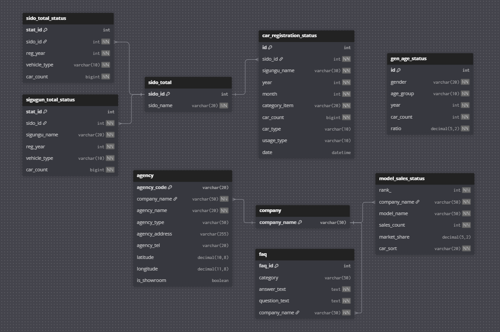
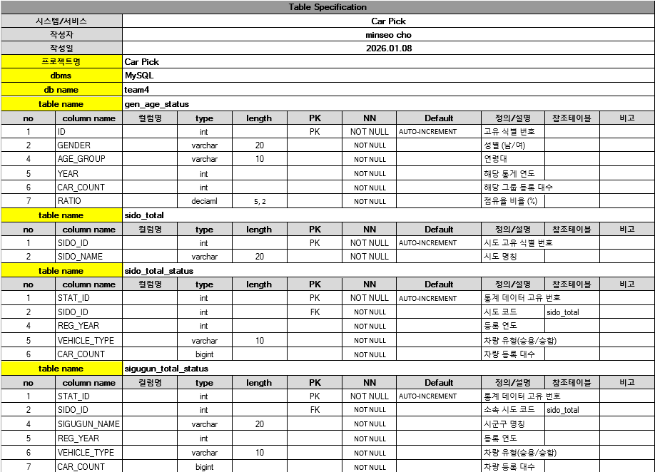
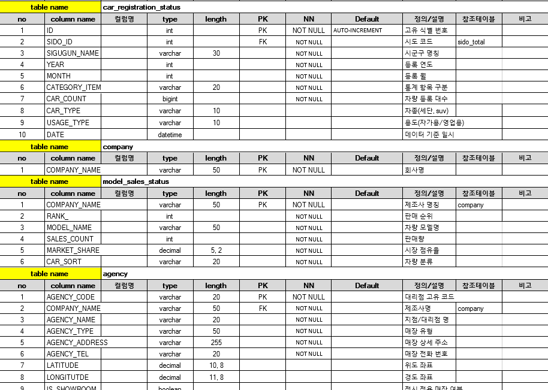
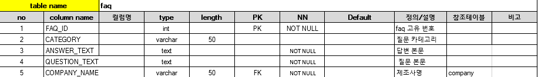

# 1. 👥 팀 소개

### 🚗 Car Pick
당신의 자동차 구매를 돕습니다.

</br>

<table>
  <tr>
    <th width="20%"><br><b>김나연</b></th>
    <th width="20%"><br><b>김서현</b></th>
    <th width="20%"><br><b>김지현</b></th>
    <th width="20%"><br><b>조민서</b></th>
    <th width="20%"><br><b>박성진</b></th>
  </tr>
  <tr>
    <td align="center"><b>팀장 / PM</b></td>
    <td align="center"><b>팀원</b</td>
    <td align="center"><b>팀원</b></td>
    <td align="center"><b>팀원</b></td>
    <td align="center"><b>팀원</b></td>
  </tr>
  <tr>
    <td valign="top">
      • <b>Streamlit</b> 최종 구현<br>
      • <b>Code Integration</b> 총괄<br>
      • 제네시스 FAQ & 현대 Agency Crawling<br>
      • 전체 차량 등록 데이터 전처리
    </td>
    <td valign="top">
      • 군·구 Crawling & <b>Folium</b> 시각화<br>
      • 차량 추천 알고리즘 로직 설계 및 구현<br>
      • 발표 전략 수립 및 스크립트 작성
    </td>
    <td valign="top">
      • 현대·기아 FAQ 데이터 <b>Pipeline</b>,<b>Crawling</b> <br>
      • 텍스트 데이터 정제 및 전처리<br>
      • <b>Streamlit</b> 인터페이스 고도화 
    </td>
    <td valign="top">
      • <b>ERD 설계</b> 및 MySQL 구축<br>
      • 지역·연령별 데이터 Crawling 및 전처리<br>
      • <b>GitHub README</b> 작성
    </td>
    <td valign="top">
      • 시·도 Crawling & <b>Folium</b> 시각화<br>
      • 차량 TOP 50 & 기아·제네시스 Agency Crawling <br>
      • 차량 추천 알고리즘 로직 설계
    </td>
  </tr>
</table>
</br>

# 2. 프로젝트 기간
2026.01.15 - 2026.01.19 

</br>

# 3. 프로젝트 개요

## 📕 프로젝트명
### 🚗 Car Pick : 당신의 자동차 구매를 돕습니다. 

</br>

## ✅ 프로젝트 배경 및 목적
- 수많은 차량 정보 속에서 구매자에게 필요한 데이터를 선별하여, 객관적인 통계 수치를 기반으로 의사결정을 내릴 수 있는 환경을 구축하고자 합니다.</br>
- 복잡한 전국 자동차 등록 데이터를 지도와 그래프로 시각화하여, 데이터의 접근성과 직관성을 높이는 데 목적이 있습니다. </br>
- 파편화된 차량 추천, FAQ, 대리점 정보를 하나로 통합하여, 사용자의 정보 탐색 효율성을 극대화하고자 프로젝트를 기획하였습니다. </br>
- 성별, 연령별, 지역별 실제 점유율 데이터를 분석하여, 사용자 개개인에게 가장 논리적이고 실질적인 차량 추천 가이드를 제공하고자 합니다. </br>


</br>

## 🖐️ 프로젝트 소개
**Car Pick**은 전국 자동차 등록 데이터를 정밀 분석하여 사용자에게 최적화된 차량 정보를 제공합니다. </br>
총 6개의 핵심 카테고리를 통해 입체적인 분석 결과를 확인해 보세요.

</br>
📊 6가지 핵심 서비스 </br>

1. **시간 흐름별 추이** </br>
&nbsp;&nbsp; - 전국 자동차 데이터를 기준으로 시도명, 시군구, 차종, 용도(관용/영업용/자가용)별 등록 대수를 그래프로 시각화합니다.

2. **지역별 추이** </br>
&nbsp;&nbsp; - Folium 기반의 지도를 통해 연도별·차종별(승용/승합) 등록 현황을 시각적으로 파악할 수 있습니다.

3. **성별·연령별 추이** </br>
&nbsp;&nbsp; - 연도별 연령대 및 성별 등록 추이를 막대 그래프로 확인하며, 버블 차트 모드를 통해 남녀 비율을 한눈에 비교 분석합니다.

4. **필터식 맞춤 추천** </br>
&nbsp;&nbsp; - 사용자의 성별, 연령, 선호 차종을 분석하여 최적의 차량 리스트를 제공합니다. </br>
&nbsp;&nbsp;&nbsp; (모델명, 가격, 선호 점유율 제공)

5. **통합 FAQ** </br>
&nbsp;&nbsp; - 현대, 기아, 제네시스 제조사별 주요 질문과 답변을 통합하여 신속한 정보 습득을 얻습니다.

6. **지점 정보** </br>
&nbsp;&nbsp; - 제조사별 전시장 및 대리점의 위치를 지도에 표시하여 내 주변 매장 분포를 즉시 확인할 수 있습니다.
</br>


## ❤️ 기대효과
**합리적 구매** : 실제 점유율 데이터와 맞춤형 추천 알고리즘을 결합하여, 사용자의 구매 실패 확률을 낮추고 만족도를 극대화합니다. </br>
**효율성 증대** : 시장 트렌드 분석부터 FAQ, 대리점 위치 파악까지 흩어져 있는 서비스를 하나로 통합하여 정보 습득에 소요되는 시간과 비용을 획기적으로 절감합니다. </br>
**가치 창출** : 사용자의 라이프 스타일에 맞춘 인사이트를 도출함으로써, 자동차 시장의 투명한 가이드 역할을 합니다.

</br> 

## 👤 대상 사용자
본 프로젝트는 자신에게 최적화된 차종과 인근 대리점 정보를 빠르게 파악하고 정확하게 찾고자 하는 **차량 구매 예정자**를 주 타겟으로 합니다. </br>
또한, 지역별·연령별로 세분화된 자동차 시장의 실질적인 트렌드를 연구하고 싶은 **데이터 분석가**나, </br>
특정 지역의 차량 보급 현황 및 경쟁사 매장 분포를 파악하여 전략적인 비즈니스 모델을 구상하려는 **자동차 업계 마케터**들에게도 유용한 인사이트를 제공합니다.

</br> 

# 4. 프로젝트 설계
### 프로젝트 구조
```
SK25-1ST-4TEAM/
│
├── app/                     # Streamlit 애플리케이션 핵심 코드
│   ├── app.py               # 메인 실행 파일 (Streamlit Entry Point)
│   │
│   ├── demogr_car/           # 자동차 등록 수 × 인구통계 시각화 모듈
│   │   ├── gen.age.py        # 연령대 기반 자동차 등록 데이터 생성·가공 함수
│   │   └── visual.py         # 인구통계·자동차 등록 수 시각화 함수 모음
│   │
│   └── brand_car/            # 브랜드별 정보 출력 모듈
│       ├── store.py          # 현대·기아·제네시스 대리점/전시장 정보 출력 함수
│       └── faq.py            # 브랜드별 FAQ 데이터 출력 함수
│   
│   
│
├── assets/                   # 이미지, 아이콘 등 정적 리소스
│
├── crawling/                 # 데이터 수집용 크롤링 노트북
│   ├── carshop_crawling.ipynb
│   └── genesis_crawling.ipynb
│
├── data/                     # 전처리 및 분석에 사용되는 데이터 파일(pkl, csv 등)
│
├── preprocessing/            # 데이터 정제·가공 스크립트
│
├── README.md                 # 프로젝트 설명 문서
└── requirements.txt          # Python 패키지 의존성 목록

```
### ERD
<p align="center"></p> 

</br>

### Table Specification
<p align="center"></p> 
<p align="center"></p> 
<p align="center"></p> 


</br>

# 5. 주요 기능 
-> (화면 사진)

</br>

# 6. 트러블 슈팅

</br>

# 7. 기술 스택 
### ⚙️ Development Environment
* **Language & Library** : 
  
  
  
* **Frontend / Dashboard** : 
  
* **Database & Management** : 
  
  

</br>

# 8. 한줄 회고
> **김나연** :   </br>
> **김서현** :   </br>
> **김지현** :   </br>
> **조민서** :   </br>
> **박성진** :   </br>
